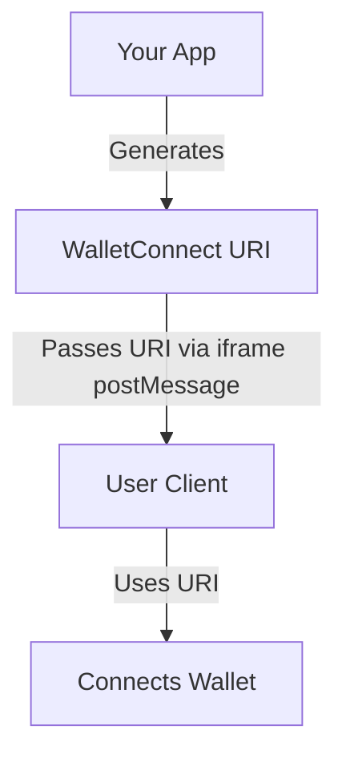

# Portability-WalletConnect

**Portability** is what we call the magic of cross-app connectivity. This allows Intersend users to connect to your app instantly with 0-click, ensuring seamless wallet integration across the ecosystem.

This repository provides a reference implementation to help developers make their existing applications compatible with Intersend. It includes examples of how to integrate WalletConnect automatically, ensuring seamless wallet connections for users without needing manual wallet selection or QR code scanning.

## Getting Started

To integrate WalletConnect into your app and ensure compatibility with Intersend, follow the instructions in this repository. The provided `WalletConnectUri.tsx` component and example `wagmiConfig.ts` demonstrate how to automatically connect user wallets and pass the WalletConnect URI to iframes.

- **Full documentation**: [https://intersend.mintlify.app/](https://intersend.mintlify.app/)
- **App examples**: [https://github.com/intersend/app-examples](https://github.com/intersend/app-examples)

- ## WalletConnect Flow



### Explanation of the Flow:
1. **Your App** generates the WalletConnect URI when initializing the WalletConnect provider.
2. **The URI** is passed to the **User Client** (e.g., an iframe or another application) via methods like `postMessage`.
3. The **User Client** uses the URI to establish a connection with the wallet, allowing wallet interaction to occur automatically.
4. The URI contains the session ID, protocol version, bridge URL, and encryption key required for secure communication.


## Key Features

- **Automatic WalletConnect Integration**: Automatically connects the user's wallet without displaying the QR code.
- **PostMessage for WalletConnect URI**: Passes the WalletConnect URI to iframes via `postMessage`, enabling easy integration with embedded apps.
- **Wagmi Configuration**: Includes a simple example of Wagmi configuration to guide developers on adding WalletConnect as a connector.

## How to Use

### 1. Add WalletConnect as a Connector
Ensure that your app is using WalletConnect as a connector. If not, add it to your Wagmi configuration. Here's a simple example:

```ts
import { createConfig, http } from 'wagmi';
import { mainnet, polygon, sepolia } from 'wagmi/chains';
import { walletConnect } from 'wagmi/connectors';

export const config = createConfig({
  chains: [mainnet, polygon, sepolia],
  connectors: [
    walletConnect({
      projectId: 'YOUR_PROJECT_ID', // Replace with your WalletConnect project ID
    }),
  ],
  transports: {
    [mainnet.id]: http(),
    [polygon.id]: http(),
    [sepolia.id]: http(),
  },
});
